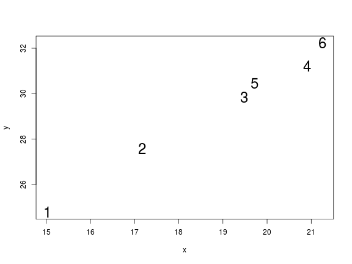

# Installing the package


To install the development version of the package, type:


```r
devtools::install_github("thibautjombart/quicksim")
```

Note that this requires the package *devtools* installed.


# What does it do?

As it currently stands, the package does not implement the process generating the transmission tree, but it does provide functions to create cases given known transmission events. 

The main features of the package include:

- **`new_case`**: a function creating a new case, either from a prior infector,
  or imported

- **`new_location`**: a function creating a new case location, either from a
  prior infector, or imported; used in `new_case`

- **`new_dna`**: a function creating the DNA sequence for a new case, either
  from a prior infector DNA sequence, or imported; used in `new_case`

- **`dist_dna`**: a function to compute pairwise genetic distances from 'case'
  data


# Demo

## A basic example

We start from the following transmission tree:

```r
tree <- matrix(c(1, 2, 2, 3, 3, 4, 2, 5, 5, 6), ncol = 2, byrow = TRUE)
colnames(tree) <- c("from", "to")
tree
#>      from to
#> [1,]    1  2
#> [2,]    2  3
#> [3,]    3  4
#> [4,]    2  5
#> [5,]    5  6

## dates of infection for cases 1-6
infection_dates <- c(0, 2, 5, 6, 7, 10)

library(igraph)
plot(graph.data.frame(tree), vertex.color = "#e0ccff")
```


We load the package, examine the default settings, make custom config, and
generate an index case:


```r
library(quicksim)

## see default config
new_config()
#> $x_min
#> [1] 0
#> 
#> $x_max
#> [1] 100
#> 
#> $y_min
#> [1] 0
#> 
#> $y_max
#> [1] 100
#> 
#> $spatial_kernel
#> function (x) 
#> stats::rnorm(length(x), mean = x, sd = sd)
#> <environment: 0x6049d98>
#> 
#> $sd_spatial
#> [1] 1
#> 
#> $genome_length
#> [1] 30000
#> 
#> $mutation_rate
#> [1] 1e-05
#> 
#> $separation_lineages
#> [1] 365

## use custom config
conf <- new_config(genome_length = 1e4,
                   mutation_rate = 1e-4,
                   separation_lineages = 10)

## create index case
index <- new_case(config = conf)
index
#> <case object>
#> 
#> /// date of infection ($date): 
#> [1] 0
#> 
#> /// place of infection ($location): 
#> [1] 15.01976 24.77853
#> 
#> /// DNA sequence mutations ($dna): 
#>  [1] 9387 5661 8326 7106  335 6542 5529 3490 1508 4547
```


We create new cases according to the transmission tree:

```r

set.seed(1)

cases <- vector(mode = "list", length = 6)
cases[[1]] <- index

for (i in seq_len(nrow(tree))) {
  infector <- tree[i, 1]
  infectee <- tree[i, 2]
  cases[[infectee]] <- new_case(cases[[infector]],
                                date = infection_dates[infectee],
                                config = conf)
}

cases
#> [[1]]
#> <case object>
#> 
#> /// date of infection ($date): 
#> [1] 0
#> 
#> /// place of infection ($location): 
#> [1] 15.01976 24.77853
#> 
#> /// DNA sequence mutations ($dna): 
#>  [1] 9387 5661 8326 7106  335 6542 5529 3490 1508 4547
#> 
#> [[2]]
#> <case object>
#> 
#> /// date of infection ($date): 
#> [1] 2
#> 
#> /// place of infection ($location): 
#> [1] 15.2034 23.9429
#> 
#> /// DNA sequence mutations ($dna): 
#>  [1] 9387 5661 8326 7106  335 6542 5529 3490 1508 4547 3722
#> 
#> [[3]]
#> <case object>
#> 
#> /// date of infection ($date): 
#> [1] 5
#> 
#> /// place of infection ($location): 
#> [1] 14.90868 23.93714
#> 
#> /// DNA sequence mutations ($dna): 
#>  [1] 9387 5661 8326 7106  335 6542 5529 3490 1508 4547 3722 6608 6292  619
#> [15] 2061 1766 6871
#> 
#> [[4]]
#> <case object>
#> 
#> /// date of infection ($date): 
#> [1] 6
#> 
#> /// place of infection ($location): 
#> [1] 15.29852 23.31589
#> 
#> /// DNA sequence mutations ($dna): 
#>  [1] 9387 5661 8326 7106  335 6542 5529 3490 1508 4547 3722 6608 6292  619
#> [15] 2061 1766 6871 3801 7775 9347 2122
#> 
#> [[5]]
#> <case object>
#> 
#> /// date of infection ($date): 
#> [1] 7
#> 
#> /// place of infection ($location): 
#> [1] 16.32833 23.89797
#> 
#> /// DNA sequence mutations ($dna): 
#>  [1] 9387 5661 8326 7106  335 6542 5529 3490 1508 4547 3722 3824
#> 
#> [[6]]
#> <case object>
#> 
#> /// date of infection ($date): 
#> [1] 10
#> 
#> /// place of infection ($location): 
#> [1] 17.14955 24.49187
#> 
#> /// DNA sequence mutations ($dna): 
#>  [1] 9387 5661 8326 7106  335 6542 5529 3490 1508 4547 3722 3824 1863 8274
#> [15] 6685
```

Some further analyses

```r
library(ape)

dna <- lapply(cases, function(e) e$dna)
locations <- matrix(unlist(lapply(cases, function(e) e$location)),
                    ncol = 2, byrow = TRUE)

## genetic distances
D_dna <- dist_dna(dna)
D_dna
#>    1  2  3  4  5
#> 2  1            
#> 3  7  6         
#> 4 11 10  4      
#> 5  2  1  7 11   
#> 6  5  4 10 14  3

plot(nj(D_dna), "unrooted", main = "Unrooted NJ tree, Hamming distances",
     show.tip.label = FALSE)

tiplabels(frame = "circ", col = "#f9ecf2", bg = "#602040", cex = 1.5)
```


```r

## spatial distances
D_geo <- dist(locations)
D_geo
#>           1         2         3         4         5
#> 2 0.8555700                                        
#> 3 0.8486961 0.2947769                              
#> 4 1.4889646 0.6341822 0.7334287                    
#> 5 1.5772623 1.1258280 1.4201915 1.1829265          
#> 6 2.1490005 2.0220963 2.3085148 2.1929952 1.0134708
plot(locations, pch = paste(1:6), xlab = "x", ylab = "y", cex = 2)
```


## Using custom spatial kernel

Customised spatial kernels can be specified as part of the config through the
argument `spatial_kernel`. The behaviour of `new_location` is as follows:

1. by default, a Normal kernel with standard deviation 1 is used
2. if provided, `sd_spatial` is used for the standard deviation of the Normal kernel
3. if provided, the alternative spatial kernel `spatial_kernel` is used instead,
   in which case `sd_spatial` is ignored.

If provided, the argument `spatial_kernel` should be a function of `x`, a vector
of spatial coordinates, and return a similarly sized vector of new coordinates.

We can repeat the previous example with a new spatial kernel:


```r
## new custom config
custom_kernel <- function(x) {
  out <- x + runif(length(x), min = 1, max = 3)
  out
}

new_conf <- new_config(genome_length = 1e4,
                       mutation_rate = 1e-4,
                       separation_lineages = 10,
                       spatial_kernel = custom_kernel)

set.seed(1)

for (i in seq_len(nrow(tree))) {
  infector <- tree[i, 1]
  infectee <- tree[i, 2]
  cases[[infectee]] <- new_case(cases[[infector]],
                                date = infection_dates[infectee],
                                config = new_conf)
}


## look at the new spatial distribution
locations <- matrix(unlist(lapply(cases, function(e) e$location)),
                    ncol = 2, byrow = TRUE)

plot(locations, pch = paste(1:6), xlab = "x", ylab = "y", cex = 2)
```




# Resources

## Vignettes

Vignettes are not currently available for this package.


## Websites

The following websites are available:

- The *quicksim* project on *github*, useful for developers, contributors, and users wanting to post issues, bug reports and feature requests: <br>
[http://github.com/thibautjombart/quicksim](http://github.com/thibautjombart/quicksim)


## Getting help online

Bug reports and feature requests should be posted on *github* using the [*issue*](http://github.com/thibautjombart/quicksim/issues) system. All other questions should be posted on the **RECON forum**: <br>
[http://www.repidemicsconsortium.org/forum/](http://www.repidemicsconsortium.org/forum/)


# A quick overview

The following worked example provides a brief overview of the package's
functionalities. 


# Contributors (by alphabetic order):
- [Thibaut Jombart](https://github.com/thibautjombart)

See details of contributions on:
<br>
https://github.com/thibautjombart/quicksim/graphs/contributors


Contributions are welcome via **pull requests**.

Please note that this project is released with a [Contributor Code of Conduct](CONDUCT.md). By participating in this project you agree to abide by its terms.

**Maintainer:** Thibaut Jombart (thibautjombart@gmail.com)
