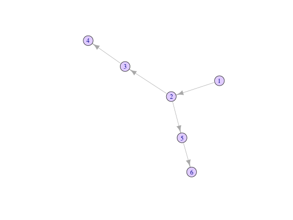

# Installing the package


To install the development version of the package, type:


```r
devtools::install_github("thibautjombart/quicksim")
```

Note that this requires the package *devtools* installed.


# What does it do?

As it currently stands, the package does not implement the process generating the transmission tree, but it does provide functions to create cases given known transmission events. 

The main features of the package include:

- **`new_case`**: a function creating a new case, either from a prior infector,
  or imported

- **`new_location`**: a function creating a new case location, either from a
  prior infector, or imported; used in `new_case`

- **`new_dna`**: a function creating the DNA sequence for a new case, either
  from a prior infector DNA sequence, or imported; used in `new_case`

- **`dist_dna`**: a function to compute pairwise genetic distances from 'case'
  data


# Demo

We start from the following transmission tree:

```r
tree <- matrix(c(1, 2, 2, 3, 3, 4, 2, 5, 5, 6), ncol = 2, byrow = TRUE)
colnames(tree) <- c("from", "to")
tree
#>      from to
#> [1,]    1  2
#> [2,]    2  3
#> [3,]    3  4
#> [4,]    2  5
#> [5,]    5  6

## dates of infection for cases 1-6
infection_dates <- c(0, 2, 5, 6, 7, 10)

library(igraph)
plot(graph.data.frame(tree), vertex.color = "#e0ccff")
```



We load the package, examine the default settings, and generate an index case:

```r
library(quicksim)

## see default config
new_config()
#> $x_min
#> [1] 0
#> 
#> $x_max
#> [1] 100
#> 
#> $y_min
#> [1] 0
#> 
#> $y_max
#> [1] 100
#> 
#> $sd_spatial
#> [1] 1
#> 
#> $genome_length
#> [1] 30000
#> 
#> $mutation_rate
#> [1] 1e-05
#> 
#> $separation_lineages
#> [1] 365

## use custom config
conf <- new_config(genome_length = 1e4,
                   mutation_rate = 1e-4,
                   separation_lineages = 0)

## create index case
index <- new_case()
index
#> <case object>
#> 
#> /// date of infection ($date): 
#> [1] 0
#> 
#> /// place of infection ($location): 
#> [1] 83.802559  7.704292
#> 
#> /// DNA sequence mutations ($dna): 
#>   [1] 19091  3724 22314  2225 14111 14006  1619 20563  8551 23318  4457
#>  [12] 17702 14959 25315 10927 29847 21681 18178 28533 21481 12277  6232
#>  [23] 22401 10156  6120 21036 24742 25299  3548 28900  4270 25316 19227
#>  [34] 17549 20724 26241 28765  3999 19192 10092 13638  8158  2385 24941
#>  [45]  5133 20365 10293 14020 19497  7711 10966  5722 23232 10910 24466
#>  [56] 16432 10376  5430 27190 29724  2516 24818 22421  4045  7353 24924
#>  [67] 27611  2404  7277 24144  8210  7720  2956 10333 29900  9023 22248
#>  [78] 21002  2582 16921 10150  4834 16980  2348  1251  8129  5713 26346
#>  [89] 21360 23958 16535  2284 18482 29606  2055   674  8682 26565  3481
#> [100] 22496  6770  4080 20830 13814  5775 14507 22732 10868 10772  4020
#> [111] 16285 21579 22037 10813 27712 25319 21885   550  3866
```


We create new cases according to the transmission tree:

```r

set.seed(1)

cases <- vector(mode = "list", length = 6)
cases[[1]] <- index

for (i in seq_len(nrow(tree))) {
  infector <- tree[i, 1]
  infectee <- tree[i, 2]
  cases[[infectee]] <- new_case(cases[[infector]],
                                date = infection_dates[infectee])
}

cases
#> [[1]]
#> <case object>
#> 
#> /// date of infection ($date): 
#> [1] 0
#> 
#> /// place of infection ($location): 
#> [1] 83.802559  7.704292
#> 
#> /// DNA sequence mutations ($dna): 
#>   [1] 19091  3724 22314  2225 14111 14006  1619 20563  8551 23318  4457
#>  [12] 17702 14959 25315 10927 29847 21681 18178 28533 21481 12277  6232
#>  [23] 22401 10156  6120 21036 24742 25299  3548 28900  4270 25316 19227
#>  [34] 17549 20724 26241 28765  3999 19192 10092 13638  8158  2385 24941
#>  [45]  5133 20365 10293 14020 19497  7711 10966  5722 23232 10910 24466
#>  [56] 16432 10376  5430 27190 29724  2516 24818 22421  4045  7353 24924
#>  [67] 27611  2404  7277 24144  8210  7720  2956 10333 29900  9023 22248
#>  [78] 21002  2582 16921 10150  4834 16980  2348  1251  8129  5713 26346
#>  [89] 21360 23958 16535  2284 18482 29606  2055   674  8682 26565  3481
#> [100] 22496  6770  4080 20830 13814  5775 14507 22732 10868 10772  4020
#> [111] 16285 21579 22037 10813 27712 25319 21885   550  3866
#> 
#> [[2]]
#> <case object>
#> 
#> /// date of infection ($date): 
#> [1] 2
#> 
#> /// place of infection ($location): 
#> [1] 83.476325  9.034092
#> 
#> /// DNA sequence mutations ($dna): 
#>   [1] 19091  3724 22314  2225 14111 14006  1619 20563  8551 23318  4457
#>  [12] 17702 14959 25315 10927 29847 21681 18178 28533 21481 12277  6232
#>  [23] 22401 10156  6120 21036 24742 25299  3548 28900  4270 25316 19227
#>  [34] 17549 20724 26241 28765  3999 19192 10092 13638  8158  2385 24941
#>  [45]  5133 20365 10293 14020 19497  7711 10966  5722 23232 10910 24466
#>  [56] 16432 10376  5430 27190 29724  2516 24818 22421  4045  7353 24924
#>  [67] 27611  2404  7277 24144  8210  7720  2956 10333 29900  9023 22248
#>  [78] 21002  2582 16921 10150  4834 16980  2348  1251  8129  5713 26346
#>  [89] 21360 23958 16535  2284 18482 29606  2055   674  8682 26565  3481
#> [100] 22496  6770  4080 20830 13814  5775 14507 22732 10868 10772  4020
#> [111] 16285 21579 22037 10813 27712 25319 21885   550  3866
#> 
#> [[3]]
#> <case object>
#> 
#> /// date of infection ($date): 
#> [1] 5
#> 
#> /// place of infection ($location): 
#> [1] 83.805833  8.213623
#> 
#> /// DNA sequence mutations ($dna): 
#>   [1] 19091  3724 22314  2225 14111 14006  1619 20563  8551 23318  4457
#>  [12] 17702 14959 25315 10927 29847 21681 18178 28533 21481 12277  6232
#>  [23] 22401 10156  6120 21036 24742 25299  3548 28900  4270 25316 19227
#>  [34] 17549 20724 26241 28765  3999 19192 10092 13638  8158  2385 24941
#>  [45]  5133 20365 10293 14020 19497  7711 10966  5722 23232 10910 24466
#>  [56] 16432 10376  5430 27190 29724  2516 24818 22421  4045  7353 24924
#>  [67] 27611  2404  7277 24144  8210  7720  2956 10333 29900  9023 22248
#>  [78] 21002  2582 16921 10150  4834 16980  2348  1251  8129  5713 26346
#>  [89] 21360 23958 16535  2284 18482 29606  2055   674  8682 26565  3481
#> [100] 22496  6770  4080 20830 13814  5775 14507 22732 10868 10772  4020
#> [111] 16285 21579 22037 10813 27712 25319 21885   550  3866 28340 19824
#> 
#> [[4]]
#> <case object>
#> 
#> /// date of infection ($date): 
#> [1] 6
#> 
#> /// place of infection ($location): 
#> [1] 83.511113  8.207856
#> 
#> /// DNA sequence mutations ($dna): 
#>   [1] 19091  3724 22314  2225 14111 14006  1619 20563  8551 23318  4457
#>  [12] 17702 14959 25315 10927 29847 21681 18178 28533 21481 12277  6232
#>  [23] 22401 10156  6120 21036 24742 25299  3548 28900  4270 25316 19227
#>  [34] 17549 20724 26241 28765  3999 19192 10092 13638  8158  2385 24941
#>  [45]  5133 20365 10293 14020 19497  7711 10966  5722 23232 10910 24466
#>  [56] 16432 10376  5430 27190 29724  2516 24818 22421  4045  7353 24924
#>  [67] 27611  2404  7277 24144  8210  7720  2956 10333 29900  9023 22248
#>  [78] 21002  2582 16921 10150  4834 16980  2348  1251  8129  5713 26346
#>  [89] 21360 23958 16535  2284 18482 29606  2055   674  8682 26565  3481
#> [100] 22496  6770  4080 20830 13814  5775 14507 22732 10868 10772  4020
#> [111] 16285 21579 22037 10813 27712 25319 21885   550  3866 28340 19824
#> 
#> [[5]]
#> <case object>
#> 
#> /// date of infection ($date): 
#> [1] 7
#> 
#> /// place of infection ($location): 
#> [1] 82.32867  8.74463
#> 
#> /// DNA sequence mutations ($dna): 
#>   [1] 19091  3724 22314  2225 14111 14006  1619 20563  8551 23318  4457
#>  [12] 17702 14959 25315 10927 29847 21681 18178 28533 21481 12277  6232
#>  [23] 22401 10156  6120 21036 24742 25299  3548 28900  4270 25316 19227
#>  [34] 17549 20724 26241 28765  3999 19192 10092 13638  8158  2385 24941
#>  [45]  5133 20365 10293 14020 19497  7711 10966  5722 23232 10910 24466
#>  [56] 16432 10376  5430 27190 29724  2516 24818 22421  4045  7353 24924
#>  [67] 27611  2404  7277 24144  8210  7720  2956 10333 29900  9023 22248
#>  [78] 21002  2582 16921 10150  4834 16980  2348  1251  8129  5713 26346
#>  [89] 21360 23958 16535  2284 18482 29606  2055   674  8682 26565  3481
#> [100] 22496  6770  4080 20830 13814  5775 14507 22732 10868 10772  4020
#> [111] 16285 21579 22037 10813 27712 25319 21885   550  3866 11402 23324
#> [122] 28041  6365 19551
#> 
#> [[6]]
#> <case object>
#> 
#> /// date of infection ($date): 
#> [1] 10
#> 
#> /// place of infection ($location): 
#> [1] 83.453599  8.699696
#> 
#> /// DNA sequence mutations ($dna): 
#>   [1] 19091  3724 22314  2225 14111 14006  1619 20563  8551 23318  4457
#>  [12] 17702 14959 25315 10927 29847 21681 18178 28533 21481 12277  6232
#>  [23] 22401 10156  6120 21036 24742 25299  3548 28900  4270 25316 19227
#>  [34] 17549 20724 26241 28765  3999 19192 10092 13638  8158  2385 24941
#>  [45]  5133 20365 10293 14020 19497  7711 10966  5722 23232 10910 24466
#>  [56] 16432 10376  5430 27190 29724  2516 24818 22421  4045  7353 24924
#>  [67] 27611  2404  7277 24144  8210  7720  2956 10333 29900  9023 22248
#>  [78] 21002  2582 16921 10150  4834 16980  2348  1251  8129  5713 26346
#>  [89] 21360 23958 16535  2284 18482 29606  2055   674  8682 26565  3481
#> [100] 22496  6770  4080 20830 13814  5775 14507 22732 10868 10772  4020
#> [111] 16285 21579 22037 10813 27712 25319 21885   550  3866 11402 23324
#> [122] 28041  6365 19551
```

Some further analyses

```r
library(ape)

dna <- lapply(cases, function(e) e$dna)
locations <- matrix(unlist(lapply(cases, function(e) e$location)),
                    ncol = 2, byrow = TRUE)

## genetic distances
D_dna <- dist_dna(dna)
D_dna
#>   1 2 3 4 5
#> 2 0        
#> 3 2 2      
#> 4 2 2 0    
#> 5 5 5 7 7  
#> 6 5 5 7 7 0
plot(nj(D_dna), "unrooted")
```


```r

## spatial distances
D_geo <- dist(locations)
D_geo
#>           1         2         3         4         5
#> 2 1.3692313                                        
#> 3 0.5093414 0.8841627                              
#> 4 0.5818223 0.8269676 0.2947769                    
#> 5 1.8040663 1.1835982 1.5697083 1.2985765          
#> 6 1.0547995 0.3351665 0.6002798 0.4951916 1.1258280
plot(locations, pch = paste(1:6), xlab = "x", ylab = "y", cex = 2)
```


# Resources

## Vignettes

Vignettes are not currently available for this package.


## Websites

The following websites are available:

- The *quicksim* project on *github*, useful for developers, contributors, and users wanting to post issues, bug reports and feature requests: <br>
[http://github.com/thibautjombart/quicksim](http://github.com/thibautjombart/quicksim)


## Getting help online

Bug reports and feature requests should be posted on *github* using the [*issue*](http://github.com/thibautjombart/quicksim/issues) system. All other questions should be posted on the **RECON forum**: <br>
[http://www.repidemicsconsortium.org/forum/](http://www.repidemicsconsortium.org/forum/)


# A quick overview

The following worked example provides a brief overview of the package's
functionalities. 


# Contributors (by alphabetic order):
- [Thibaut Jombart](https://github.com/thibautjombart)

See details of contributions on:
<br>
https://github.com/thibautjombart/quicksim/graphs/contributors


Contributions are welcome via **pull requests**.

Please note that this project is released with a [Contributor Code of Conduct](CONDUCT.md). By participating in this project you agree to abide by its terms.

**Maintainer:** Thibaut Jombart (thibautjombart@gmail.com)
